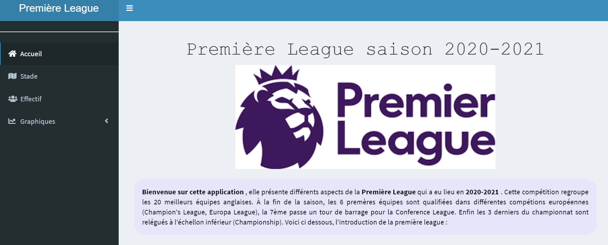

```{r, echo=FALSE,warning=FALSE, message=FALSE}
library(shiny)
library(shinythemes)
library(shinydashboard)
library(gdata)
library(rintrojs)
library(shinyjs)
library(dplyr)
library(tidyr)
library(stringr)
library(ggplot2)
library(leaflet)
library(DT)
```

```{r echo=FALSE, warning=FALSE, message=FALSE}
pl<- read.csv2("pl.csv", sep=",")
pl<-pl[-c(1,2),]
colnames(pl)<-c("ID","Joueur","Nation","Poste","Equipe","Age","Naissance","MJ","Titulaire","MinutesJouees","MinJ/90","Buts","PDT","ButsSansPenT","PenaltysMarT","PenaltysTen","CJT","CRT","Buts/90","PD/90","ButsSansPen/90","PenaltysMar/90","CJ/90","CR/90","xGT","sPenxGT","xAT","sPenxGT+xAT","xG/90","xA/90","xG+xA/90","sPenxG/90")
pl<-pl[,-33] 
pl$Joueur<-gsub("\\", ":", pl$Joueur, fixed=TRUE) 
pl<-separate(pl, Joueur, c("Joueur","A enlever"), sep = ":")
pl<-pl[,-3] 
pl<-separate(pl, Nation, c("A enlever","Nation"), sep = " ")
pl<-pl[,-3] 
pl$ID<-as.integer(pl$ID)

for (i in 1:13){
  pl[,i+5]<-as.integer(pl[,i+5])
}

for (i in 19:32){
  pl[,i]<-as.double(pl[,i])
}

stade <- read.csv2("Stadium.csv", sep=",")
stade[,2]<-as.numeric(stade[,2])
stade[,3]<-as.numeric(stade[,3])
```

## Organisation du Travail

Notre travail s'est divisé en trois parties:\newline 

- Découverte de R et de RStudio avec apprentissage des moyens de coder sur Rstudio.\newline

- Dévellopement de l'application Shiny.\newline

- Rédaction des comptes rendus et diapo.\newline

## Présentation de la page d'acueil de l'application Shiny.



## R for Data Science.

L'ouvrage disponible en ligne R for data science de Hadley Wickham a était une grande source d'informations pour nous aider dans notre travail. \url{https://r4ds.had.co.nz/}.

```{r, echo=FALSE, out.width="20%",fig.height = 12, fig.width=12, fig.cap="Première de couverture de R for DataScience"}
knitr::include_graphics("cover.png")
```

